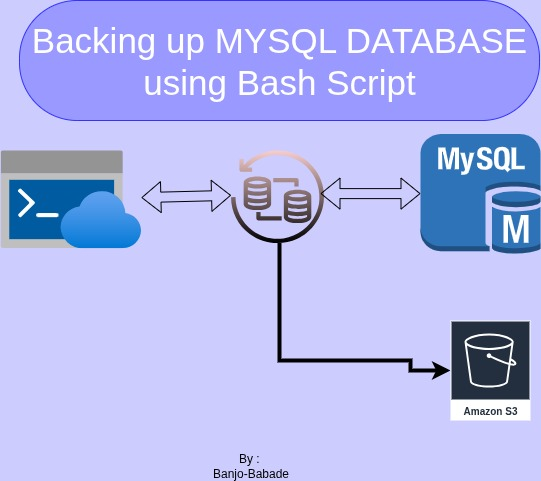

# This is a simple Automation Script that backup MySQL Database using Bash as well as Upload the file to AWS s3 bucket.



### This project assume you have a MySQL Database Administration Skills already and AWS S3

### Ensure to run these.....................

### Install awscli
```
sudo install awscli
aws configure
```
1. AWS Access Key ID
2. AWS Secret Access Key
3. Region (e,g, us-east-1)
4. Output format (leave it blank)

### The Bash Code

```
#!/bin/bash

# Database credentials
DB_USER="your_username"
DB_PASS="your_password"
DB_NAME="your_database"
MYBUCKET_NAME="Daily-Bucket"

### Backup directory
BACKUP_DIR="/path/to/backup/directory"

### Date format for the backup file
DATE=$(date +"%Y-%m-%d_%H-%M-%S")
BACKUP_FILE="$BACKUP_DIR/$DB_NAME-backup-$DATE.sql"

### Create backup directory if it doesn't exist
mkdir -p "$BACKUP_DIR"

### Perform database backup using mysqldump
mysqldump -u "$DB_USER" -p"$DB_PASS" "$DB_NAME" > "$BACKUP_FILE"

Upload to S3
aws s3 cp "$BACKUP_FILE" "s3://$MYBUCKET_NAME/daily_backup/$BACKUP_FILE"

### Check if the backup was successful
if [ $? -eq 0 ]; then
    echo "Database backup successful: $BACKUP_FILE"
else
    echo "Database backup failed"
fi

rm "$BACKUP_FILE"

```

```
chmod +x /home/banjo/backup.sh
```

   
### CRONTAB
```
crontab -e
```
### Enter the following code in the crontab so as to do the back up Daily at 5:00PM
```
0 17 * * * /home/banjo/backup.sh
```


